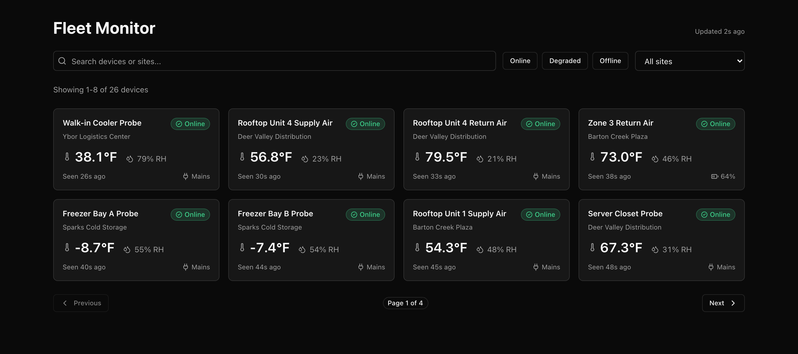
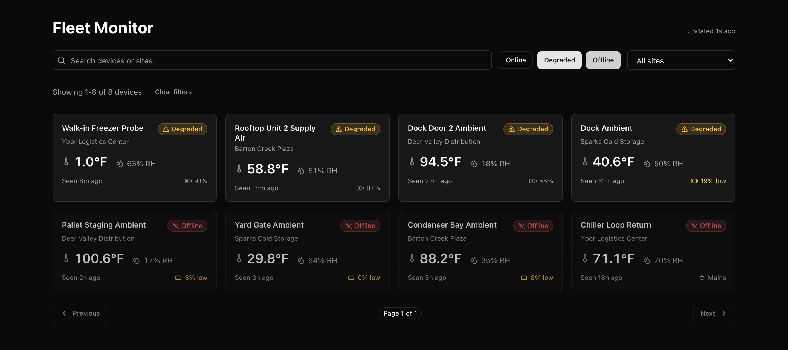

# Fleet monitor exercise

A 60-minute coding exercise. Read this file all the way through before you write code.

Working code is the floor here, not the bar. We're reading for API design judgment, correctness when the input is bad and the data is stale, and whether you can explain the calls you made while you make them.



---

## The problem

You're building the operator-facing fleet view for a network of environmental sensors across four customer sites. Rooftop HVAC units, walk-in cooler probes, dock ambient sensors. Someone in a network operations seat keeps this page open all day to answer one question: which devices need attention right now?

The fleet, its mock telemetry, and the wire types are already here. You build the listing endpoint and the UI that reads it.

---

## The stack

| Half     | What                                 |
| -------- | ------------------------------------ |
| Backend  | Python 3.10+, FastAPI, Pydantic v2   |
| Frontend | Vite, React 19, TypeScript, Tailwind |

No meta-framework. The API is real HTTP and the client is a plain React app.

How you fetch on the client is your call. Native `fetch` in an effect, a hook you write, RTK Query, TanStack Query. If you install something, tell us what it buys you here.

---

## What's provided

| Path                                            | Status    | What it is                                           |
| ----------------------------------------------- | --------- | ---------------------------------------------------- |
| `backend/app/models.py`                         | Provided  | Pydantic wire models, snake_case in, camelCase out   |
| `backend/app/data.py`                           | Provided  | 26 devices across 4 sites, plus a readings generator |
| `backend/app/clock.py`                          | Provided  | `utc_now()`, the timezone-aware request clock        |
| `backend/app/main.py`                           | Provided  | App wiring, CORS, latency middleware, `/api/sites`   |
| `frontend/src/types/device.ts`                  | Provided  | TS mirrors of the wire models                        |
| `frontend/src/components/ui/**`                 | Provided  | Button, Input, Select, Badge, Card, Skeleton         |
| `frontend/src/hooks/use-debounce.ts`            | Provided  | A debounce hook, so you don't rewrite one            |
| `backend/app/routers/devices.py`                | Your task | The listing endpoint                                 |
| `frontend/src/components/fleet/device-card.tsx` | Your task | The device card                                      |
| `frontend/src/App.tsx`                          | Your task | The fleet page                                       |

Don't modify the provided files. If one has a bug or a limitation that blocks you, say so out loud instead of quietly working around it.

`GET /api/sites` in `main.py` is already written. The UI needs it, and it shows you the response conventions this codebase uses.

---

## Your tasks

### Task 1: devices endpoint

`backend/app/routers/devices.py`

Build `GET /api/devices`. Every parameter is optional.

| Param          | Type     | Default          | Behavior                                                                                                     |
| -------------- | -------- | ---------------- | ------------------------------------------------------------------------------------------------------------ |
| `search`       | `string` | none             | Case-insensitive substring match on `name` or `siteName`. Trim it. Empty or whitespace-only means no filter. |
| `status`       | `enum`   | none             | `online \| degraded \| offline`. Repeatable, so `?status=online&status=degraded` means OR.                   |
| `siteId`       | `string` | none             | Exact match against a device's site.                                                                         |
| `staleMinutes` | `number` | none             | Positive integer. Keep only devices whose `lastSeenAt` is more than N minutes old.                           |
| `sort`         | `enum`   | `last_seen_desc` | `last_seen_desc \| last_seen_asc \| name_asc`.                                                               |
| `page`         | `number` | `1`              | 1-indexed, positive integer.                                                                                 |
| `pageSize`     | `number` | `8`              | Positive integer. Clamp to `24` if larger. Don't reject it.                                                  |

**Validation rules**:

- `status` or `sort` carrying a value outside its set returns `400`.
- `page`, `pageSize` or `staleMinutes` present but not a positive integer returns `400`. That covers non-numeric, `0`, negative, and decimals like `1.5`.
- An unknown `siteId` returns `200` with an empty `data` array, not a `400`. Sites are an open set that changes without a deploy. `status` and `sort` are closed sets baked into this contract. We'll ask you to defend that split, and you're free to disagree with it as long as you argue it.
- A `page` past the last page of results returns `200`, an empty `data` array, and accurate `total`, `page` and `pageSize`.
- Pick an error body shape, document it, and use it for every 400.
- FastAPI hands you `422`s for free if you declare typed `Query` params. Decide whether to lean on that and translate, or validate by hand.

A success response matches `DevicesResponse`:

```json
{
  "data": [],
  "total": 26,
  "page": 1,
  "pageSize": 8,
  "generatedAt": "2026-09-18T15:47:10.307507+00:00"
}
```

`total` counts matches after filtering and before pagination.

`generatedAt` is the server clock. The UI reads relative times off it instead of `Date.now()`, so a timestamp on screen can't disagree with the payload it arrived in. Use one `utc_now()` value for the whole request, so `staleMinutes` and `generatedAt` agree with each other.

Middleware already adds 150-300ms of latency. You don't need to.

### Task 2: device card

`frontend/src/components/fleet/device-card.tsx`

Takes one `Device` plus `now`, the response's `generatedAt`, and renders:

- Name and site.
- Status, and not in color alone. A color-blind operator has to be able to read it.
- Last seen, relative: `42s ago`, `14m ago`, `5h ago`. Clock is the `now` prop, not `Date.now()`.
- Latest temperature in Fahrenheit, since `tempC` is Celsius, and humidity. `latestReading` is `null` for a device that has never reported, and one device in the fleet is in exactly that state.
- Battery. `batteryPct` is `null` on mains-powered devices. Flag a low battery.
- An offline device should look different from an online one.

Semantic HTML, and real `aria` or alt text where it earns its place.

Degraded and offline devices in the reference solution, with a low battery called out:



### Task 3: fleet page

`frontend/src/App.tsx`

1. A search input, a status filter, and a site filter. The site list comes from `GET /api/sites`.
2. Fetch `GET /api/devices` with the active filters.
3. Debounce the search 300ms. `useDebounce` is provided.
4. A loading state.
5. An error state with a retry, including the `400`s your own API returns. Go trigger one.
6. An empty state.
7. A grid of `<DeviceCard />`.
8. Previous and Next pagination driven by `total` and `pageSize`.
9. Reset to page 1 when a filter changes.
10. Ignore stale responses. If the user changes a filter or page before an in-flight request resolves, the older response landing later must never overwrite newer data. Use `AbortController`, a request-sequence guard, or a library with cancellation built in. Your call, but defend it.
11. Poll every 10 seconds so the view stays current, and show how fresh the data is, like "updated 3s ago". A poll must not flash the loading state over good data, must not fight the user's typing, and should stop while the tab is hidden.

Item 11 is the one most likely to run out of clock. If it does, stop and talk us through the design. We'd rather hear how you'd build it than watch half of it get built.

`StrictMode` is on in `main.tsx`, so effects run twice in dev. That's deliberate. It breaks exactly the code that items 10 and 11 are about.

---

## Stretch goals

If you finish early, take any of these in any order.

- URL sync, so the filters and page live in the URL and a view is shareable.
- A result count, like "Showing 1-8 of 26 devices".
- A readings sparkline. Add `GET /api/devices/{id}/readings?windowMinutes=`. `sample_readings()` in `data.py` already generates the series.
- An optimistic acknowledge. `POST /api/devices/{id}/ack`, with an optimistic UI update and a rollback path when it fails.
- Skeleton loading. `Skeleton` is provided.
- Tests. `pytest` for the validation matrix, or Vitest and RTL for the card or the debounce hook. Both are wired up.
- Production hardening. Cache headers or an `ETag` on the endpoint, or a basic rate-limit guard, and the reasoning behind the choice.

---

## Getting started

Two terminals.

Terminal 1, the API, on Python 3.10 or newer:

```bash
cd backend
python3 -m venv .venv && source .venv/bin/activate
pip install -r requirements.txt
uvicorn app.main:app --reload --port 8100
```

Swagger UI lands at [http://localhost:8100/docs](http://localhost:8100/docs).

Terminal 2, the web app:

```bash
cd frontend
npm install
npm run dev
```

The app runs at [http://localhost:5173](http://localhost:5173). Vite proxies `/api` to port 8100, so the client fetches relative URLs and never touches CORS.

Once Task 1 is done, these should hold:

```bash
curl "http://localhost:8100/api/devices?status=offline"                 # 200, the offline devices
curl "http://localhost:8100/api/devices?status=online&status=degraded"  # 200, OR of both
curl "http://localhost:8100/api/devices?staleMinutes=60"                # 200, only long-silent devices
curl "http://localhost:8100/api/devices?status=broken"                  # 400
curl "http://localhost:8100/api/devices?page=0"                         # 400
curl "http://localhost:8100/api/devices?pageSize=1000"                  # 200, clamped to 24
curl "http://localhost:8100/api/devices?siteId=site-nope"               # 200, empty data
curl "http://localhost:8100/api/devices?page=99"                        # 200, empty data, total intact
```

Other checks worth knowing: `npm run typecheck`, `npm test`, and `pytest` from `backend/`.

---

## Ground rules

- TypeScript on the frontend, type hints on the backend. Avoid `any`.
- Install packages if you want, though everything here is enough to finish.
- Talk through your thinking as you go. No trick questions, no single right answer.
- Ask questions whenever.
- No AI tools. We want to see how you solve this.
